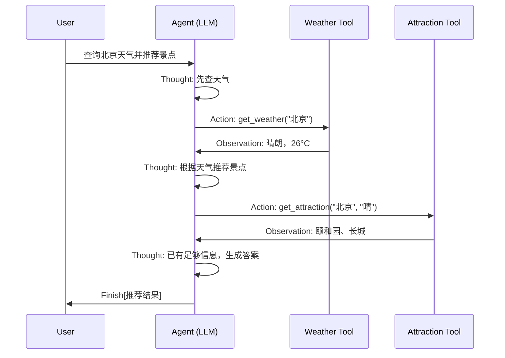

# 第一章 初识智能体

> [!info] 学习概览
> **目标**: 理解智能体的基本概念、分类和运行机制
> **实践**: 构建第一个智能旅行助手
> **重点**: 掌握 Thought-Action-Observation 范式

---

## 1. 核心概念

### 1.1 什么是智能体 (Agent)?

智能体是能够通过**传感器**感知环境，并通过**执行器**自主采取**行动**以达成目标的实体。

**四个基本要素**:

- 🌍 **环境 (Environment)**: 智能体所处的外部世界
- 📡 **传感器 (Sensors)**: 感知环境的工具（摄像头、API等）
- 🎮 **执行器 (Actuators)**: 改变环境的工具（机械臂、代码执行等）
- 🧠 **自主性 (Autonomy)**: 基于感知独立决策的能力

```
感知 → 思考 → 行动 → 环境变化 → 反馈
  ↑                                    |
  └────────────────────────────────────┘
```

### 1.2 智能体的演进


| 类型          | 特点          | 例子      |
| ----------- | ----------- | ------- |
| **反射智能体**   | 条件-动作规则，无记忆 | 自动恒温器   |
| **模型反射智能体** | 内部世界模型，有记忆  | 自动驾驶汽车  |
| **目标智能体**   | 主动规划达成目标    | GPS导航   |
| **效用智能体**   | 多目标权衡       | 智能推荐系统  |
| **学习型智能体**  | 从经验学习       | AlphaGo |


### 1.3 LLM驱动的智能体

**传统智能体 vs LLM智能体**:


| 维度   | 传统智能体   | LLM智能体 |
| ---- | ------- | ------ |
| 核心引擎 | 硬编码规则   | 预训练大模型 |
| 知识来源 | 人工构建知识库 | 隐式世界模型 |
| 交互方式 | 结构化输入   | 自然语言对话 |
| 泛化能力 | 特定任务    | 通用任务处理 |


**核心能力**:

- ✅ **规划与推理**: 将模糊目标分解为子任务
- ✅ **工具使用**: 主动调用外部API补全信息
- ✅ **动态修正**: 根据反馈调整行为

---

## 2. 智能体分类

### 2.1 基于决策时间

**反应式 (Reactive)** ⚡

- 即时响应，低延迟
- 优势: 速度快
- 劣势: 短视，难处理复杂任务

**规划式 (Deliberative)** 🎯

- 深思熟虑后再行动
- 优势: 战略性强
- 劣势: 计算成本高

**混合式 (Hybrid)** 🔄

- 结合两者优点
- LLM智能体典型模式: 思考-行动-观察循环

### 2.2 基于知识表示

**符号主义 AI** 📚

- 逻辑规则 + 知识图谱
- 可解释性强，但脆弱

**亚符号主义 AI** 🧠

- 神经网络，从数据学习
- 模式识别强，但黑箱

**神经符号主义** 🔗

- 融合两者优势
- LLM智能体正是此范式实践

---

## 3. 运行机制

### 3.1 PEAS模型

描述任务环境的四个维度:

- **P**erformance: 性能度量标准
- **E**nvironment: 环境特性
- **A**tuators: 执行器
- **S**ensors: 传感器

### 3.2 Agent Loop (智能体循环)

```
┌─────────────────────────────────────────┐
│         智能体核心循环                    │
├─────────────────────────────────────────┤
│                                         │
│   ┌──────────┐    ┌──────────┐         │
│   │ Perception │──→│  Thought  │         │
│   │  (感知)   │    │  (思考)   │         │
│   └──────────┘    └────┬─────┘         │
│        ↑             │                 │
│        │             ↓                 │
│   ┌────┴────┐    ┌──────────┐         │
│   │ Observation│←──│  Action  │         │
│   │  (观察)   │    │  (行动)   │         │
│   └──────────┘    └──────────┘         │
│                                         │
└─────────────────────────────────────────┘
```

**循环阶段**:

1. **感知 (Perception)**: 接收环境输入
2. **思考 (Thought)**:
  - 规划 (Planning): 制定行动计划
  - 工具选择 (Tool Selection): 选择执行工具
3. **行动 (Action)**: 调用工具，改变环境
4. **观察 (Observation)**: 接收执行结果反馈

### 3.3 Thought-Action-Observation 协议

**输出格式**:

```
Thought: [分析当前情境，规划下一步]
Action: [具体的工具调用或Finish]
```

**示例**:

```
Thought: 用户想知道北京天气，我需要调用天气查询工具
Action: get_weather(city="北京")

Observation: 北京当前天气:晴，气温26摄氏度
```

---

## 4. 实践：智能旅行助手

### 4.1 核心组件

**系统提示词 (System Prompt)**:
定义智能体角色、可用工具和输出格式。

**工具函数 (Tools)**:

1. `get_weather(city)` - 查询天气
2. `get_attraction(city, weather)` - 推荐景点

**LLM客户端**:
连接OpenAI兼容API，生成决策。

### 4.2 执行流程




### 4.3 代码结构

```python
# 1. 定义工具
available_tools = {
    "get_weather": get_weather,
    "get_attraction": get_attraction,
}

# 2. 配置LLM
llm = OpenAICompatibleClient(model, api_key, base_url)

# 3. 主循环
for i in range(max_iterations):
    # 3.1 LLM生成Thought+Action
    output = llm.generate(prompt_history, system_prompt)
    
    # 3.2 解析Action
    action = parse_action(output)
    
    # 3.3 执行工具
    if action == "Finish":
        break
    observation = available_tools[tool_name](**kwargs)
    
    # 3.4 记录观察结果
    prompt_history.append(f"Observation: {observation}")
```

---

## 5. 关键设计点

### 5.1 智能体架构模式


| 模式       | 描述          | 适用场景      |
| -------- | ----------- | --------- |
| **单智能体** | 单个LLM循环处理   | 简单任务      |
| **多智能体** | 多个Agent协作   | 复杂多角色任务   |
| **分层**   | 高层规划 + 底层执行 | 需要快速反应的任务 |


### 5.2 协作协议

- **A2A (Agent-to-Agent)**: Google提出的智能体间通信标准
- **MCP (Model Context Protocol)**: Anthropic提出的模型上下文协议
- **ANP (Agent Network Protocol)**: 智能体网络协议

---

## 6. 实验与收获

### 6.1 运行示例代码

**步骤**:

1. 安装依赖: `pip install requests tavily-python openai`
2. 配置API密钥
3. 运行主循环

**预期输出**:

```
循环 1: get_weather("北京") → 晴朗 26°C
循环 2: get_attraction("北京", "晴") → 颐和园、长城
循环 3: Finish[完整推荐]
```

### 6.2 核心收获

1. **智能体 = LLM + 工具 + 循环**
  - LLM提供推理能力
  - 工具扩展能力边界
  - 循环实现持续交互
2. **提示工程是关键**
  - System Prompt定义行为规范
  - 输出格式必须严格约束
3. **可扩展性强**
  - 添加新工具即可扩展功能
  - 修改Prompt即可调整行为

---

## 7. 拓展方向

- 添加更多工具（酒店预订、交通查询）
- 实现多城市行程规划
- 增加用户偏好记忆
- 接入更多LLM提供商

---

**参考**: [Hello-Agents 第一章](https://github.com/datawhalechina/hello-agents/blob/main/docs/chapter1/%E7%AC%AC%E4%B8%80%E7%AB%A0%20%E5%88%9D%E8%AF%86%E6%99%BA%E8%83%BD%E4%BD%93.md)